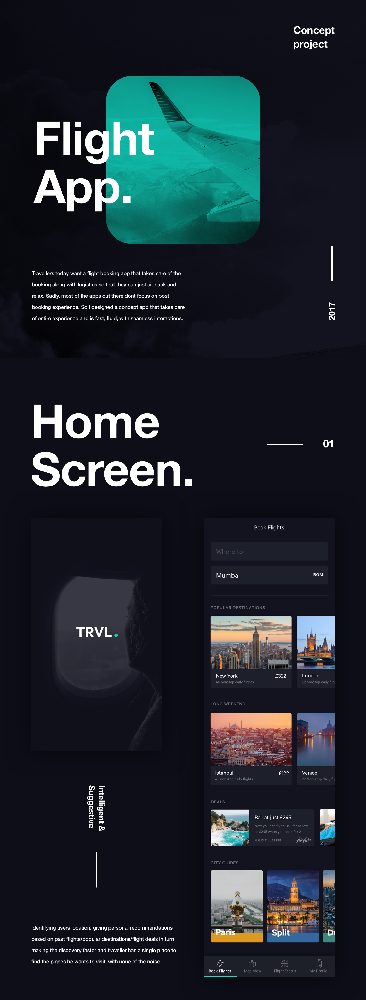
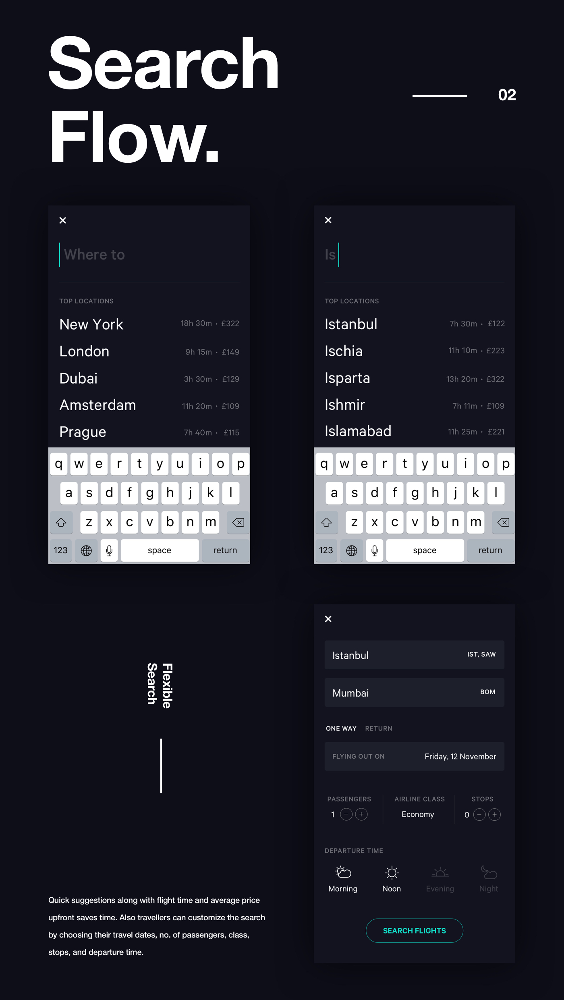
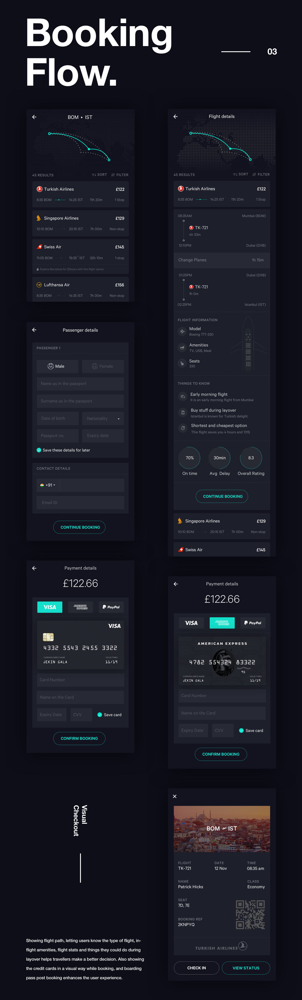
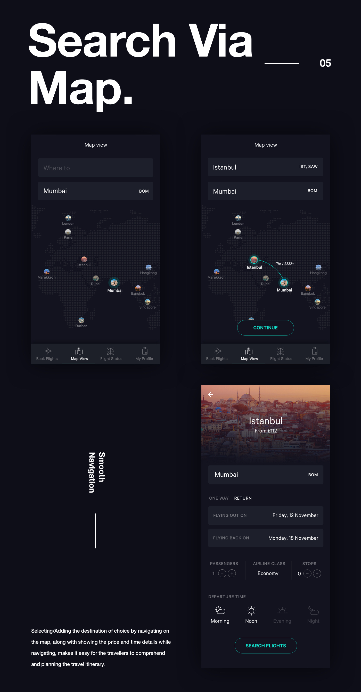
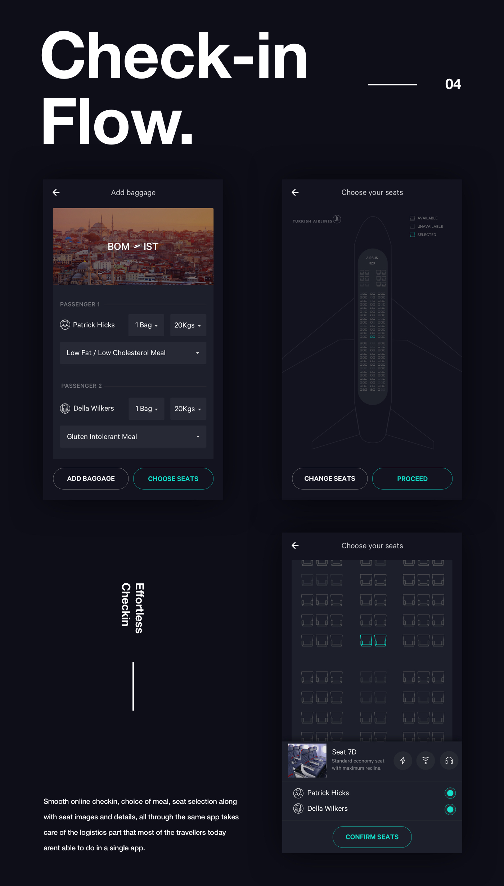
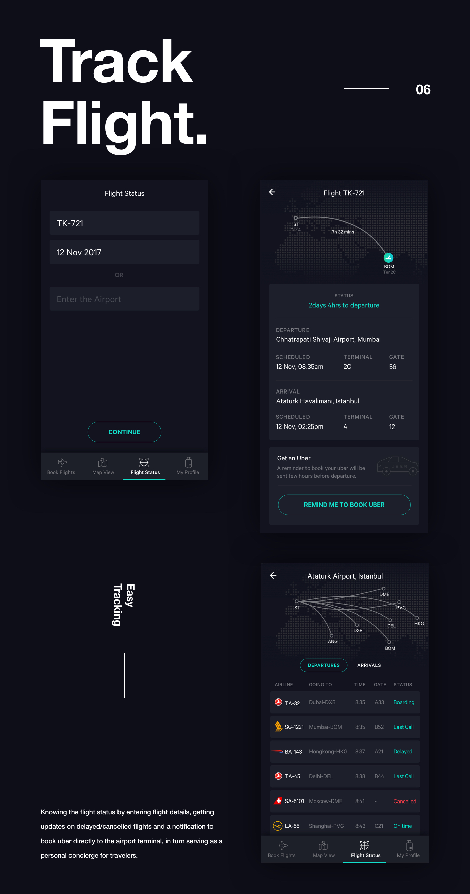
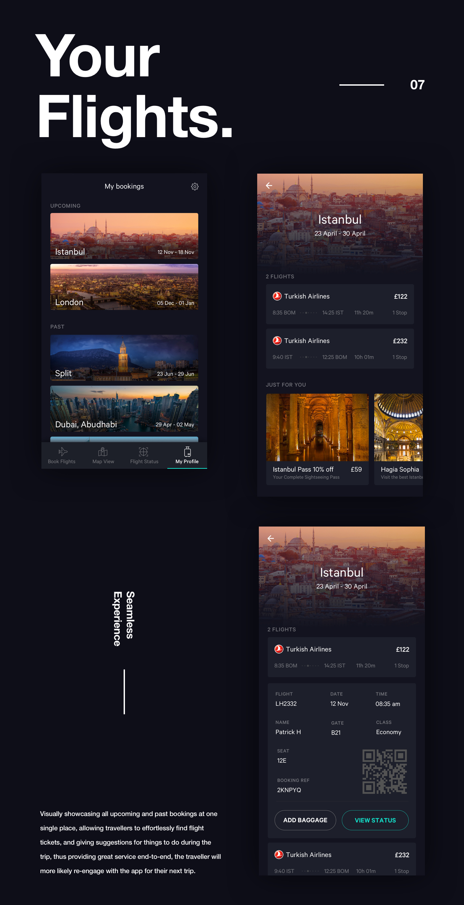
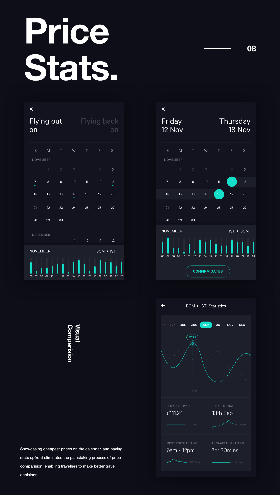

# Flight/Airline Ticket booking app
This project contains Static screen design of flight booking and information

It is with the reference of 
https://www.uplabs.com/posts/flight-app-concept-kit

To run this project with images follow below steps :

<B>1) Add all the images from images folder to your local directory </B>

<B>2) Do changes in the IMAGE_BASE_URL in CommonUtilities.java file according to local server URL (Ex: Localhost) </B>

